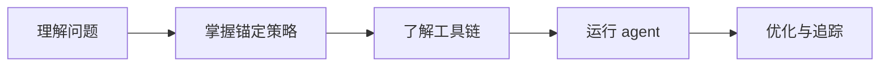

# 电商产品图一致性 - 新手到专家路线

> 从理解问题到运行 agent 全管线的渐进式阅读路线。

## 路线概览



---

## 阶段一：理解问题（30 分钟）

**目标**：明白为什么 AI 生图的一致性如此困难。

1. 阅读 [[UPS 统一产品描述锚]] — 核心难题与解决思路
2. 浏览 `agent/references/consistent_generation_guide.md` — 五大锚定策略
3. 查看 [[产品一致性风险地图]] — 常见失败模式

**自检**：能解释「为什么 Scene 1 和 Scene 5 的产品会看起来不一样」。

---

## 阶段二：掌握锚定策略（1 小时）

**目标**：理解并能在 prompt 层面应用五大策略。

| 顺序 | 实体页 | 要点 |
|-----|--------|------|
| 1 | [[UPS 统一产品描述锚]] | 所有场景共享同一产品描述 |
| 2 | [[参考图锚定策略]] | reference_images 是最强锚 |
| 3 | [[场景模板体系]] | 10 套场景 + 6 类目模板 |
| 4 | [[一致性检测]] | 如何量化验证 |

**实践**：打开 `agent/templates/scenes/scene_01_white_bg.json`，找到 UPS 嵌入位置。

---

## 阶段三：了解工具链（1 小时）

**目标**：知道 agent 各模块分工。

1. [[多引擎调度]] — 5 引擎如何自动选择
2. [[玩家库 Index]] — Gemini / MJ / SD 等能力对比
3. [[平台适配规格]] — 15 平台输出规格
4. [[AI电商视觉产业链地图]] — 上下游关系

**代码对照**：
- 总控：`agent/scripts/auto_pipeline.py`
- 检测：`agent/scripts/consistency_checker.py`

---

## 阶段四：运行 agent（30 分钟）

**目标**：完成一次端到端生成。

```bash
# Web UI（推荐）
python agent/web/app.py --port 8080

# 或命令行
python agent/scripts/auto_pipeline.py --images product.jpg --name "产品名"
```

**产出检查**：
- `outputs/final/` 10 张成品图
- `reports/` 一致性检测报告

---

## 阶段五：优化与追踪（持续）

**目标**：建立反馈闭环。

1. [[2026-Q2 追踪表]] — 跟踪引擎/模型变化
2. [[产品一致性研究框架]] — 系统性实验设计
3. 使用 `ab_test_runner.py` 记录偏好
4. 新发现写入 Wiki inbox，触发增量更新

---

## 进阶分支

| 兴趣方向 | 继续阅读 |
|---------|---------|
| 多平台出海 | [[平台适配规格]]、Amazon/Shopify 玩家页 |
| 情绪与转化 | emotion_scorer、scene_09_review_social |
| 自动化管线 | auto_pipeline 六步串联 |
| 研究方法论 | [[方法论 - Persistent Wiki vs RAG]] |

## 相关

- [[阅读路线 Index]]
- [[Wiki Index]]
- [[产品一致性研究框架]]
