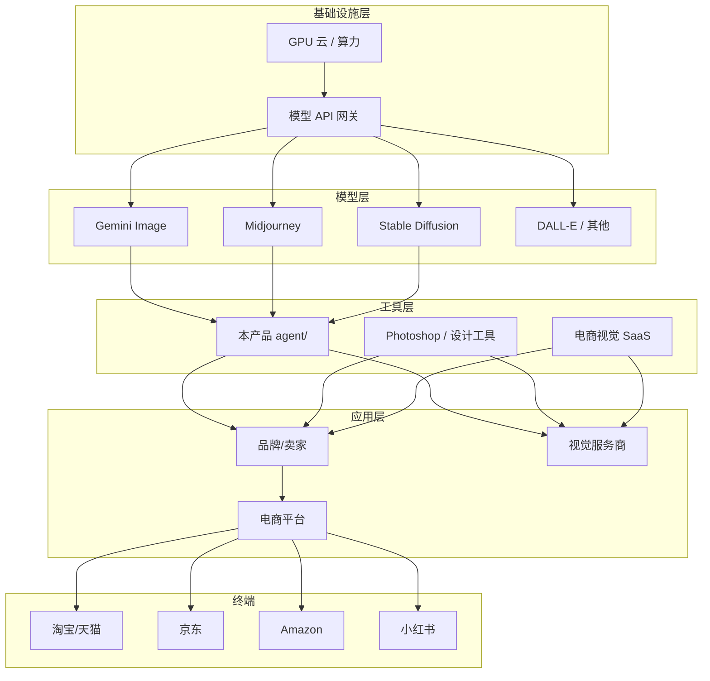

# AI电商视觉产业链地图

> 从模型层到电商平台的 AI 产品图生成产业链。

## 产业链全景



---

## 各环节说明

### 1. 基础设施层

| 环节 | 角色 | 与本项目关系 |
|-----|------|------------|
| GPU 云 | AWS/GCP/Azure/国内云 | 模型推理依赖 |
| API 网关 | Google AI、Replicate 等 | `engine_config.yaml` 配置 |

### 2. 模型层

| 玩家 | 定位 | 一致性能力 | 详见 |
|-----|------|-----------|------|
| Gemini | 多模态、支持 subject_reference | ⭐⭐⭐⭐ | [[Gemini Image Generation]] |
| Midjourney | 艺术质量高 | ⭐⭐ | [[Midjourney]] |
| Stable Diffusion | 开源可控 | ⭐⭐⭐ | [[Stable Diffusion]] |

→ 详见 [[玩家库 Index]]

### 3. 工具层（本项目位置）

**agent/** 定位：全自动产品摄影工作室

```
上传产品图 → 分析 → 场景匹配 → 多引擎生成 → 后处理 → 平台适配 → 一致性检测
```

关键模块：
- [[多引擎调度]] — 引擎选择
- [[场景模板体系]] — 场景设计
- [[一致性检测]] — 质量门禁
- [[平台适配规格]] — 多平台输出

### 4. 应用层

| 角色 | 需求 | agent 如何满足 |
|-----|------|---------------|
| 中小卖家 | 低成本批量主图 | auto_pipeline 一键生成 |
| 品牌方 | 风格统一、品牌水印 | layout_engine + style_pipeline |
| 视觉服务商 | 批量+可配置 | 分步脚本 + Web UI |

### 5. 终端平台

15 平台规格见 [[平台适配规格]]。

---

## 价值流向

```
模型能力 ↑ → 工具封装（锚定策略）→ 卖家效率 ↑ → 平台内容质量 ↑
                     ↑
              Wiki 知识积累（本库）
```

---

## 趋势观察（待持续更新）

| 趋势 | 影响 | 追踪 |
|-----|------|------|
| 多模态 reference 增强 | 一致性提升 | [[2026-Q2 追踪表]] |
| 平台 AI 生图规范 | 合规要求 | [[风险地图 Index]] |
| 端到端 Agent 化 | 工具层整合 | 本 agent 演进 |

---

## 相关

- [[产业链 Index]]
- [[玩家库 Index]]
- [[产品一致性研究框架]]
